# 근대로

  

  근대에서 오늘로 이어지는 특별한 지도 <strong>근대로</strong>

  <a href="https://m.onestore.co.kr/v2/ko-kr/app/0001002384">
    👉 근대로 바로가기
  </a>
  

---
## 목차
1. [프로젝트 개요](#프로젝트-개요)
2. [프로젝트 소개](#프로젝트-소개)
3. [주요 화면 및 기능 소개](#주요-화면-및-기능-소개)
4. [기술 스택](#기술-스택)
5. [시스템 아키텍처](#시스템-아키텍처)
6. [ERD](#erd-entity-relationship-diagram)
7. [성과](#성과)
8. [팀원](#팀원)

---

## 프로젝트 개요

- **서비스명**: 근대로
- **팀명**: 6각형인재
- **개발 기간**: 2025.09.01 ~ 2025.09.30 (4주)  
- **개발 인원**: 3명 (Backend 1명, Infra 1명, Android 1명)

---

## 프로젝트 소개

  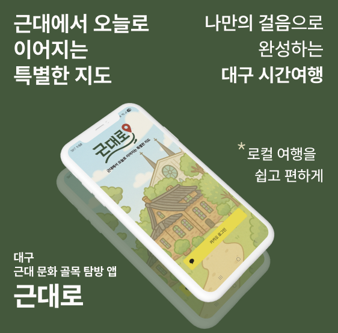

  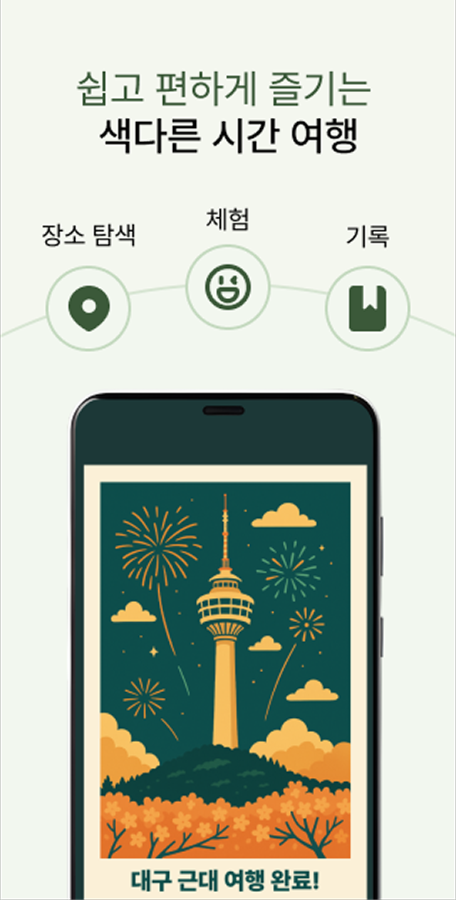
  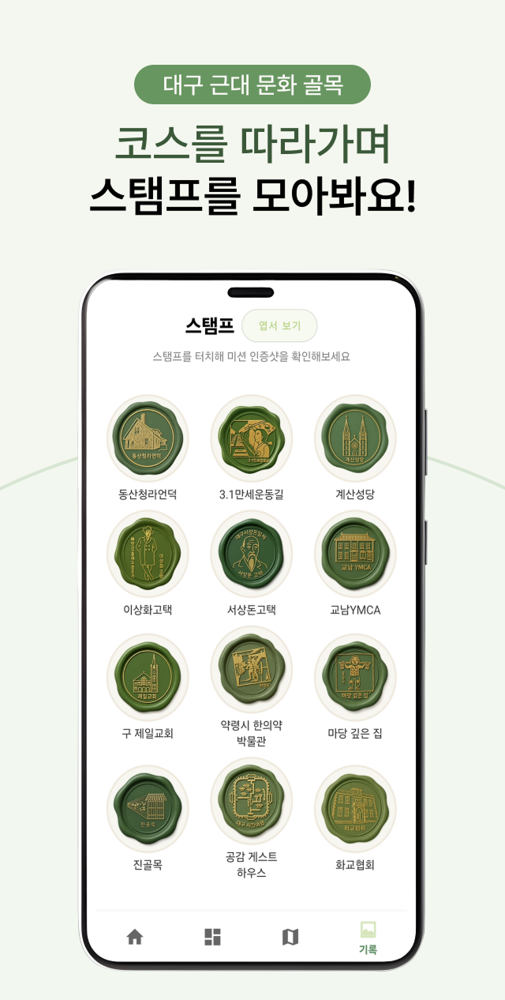
  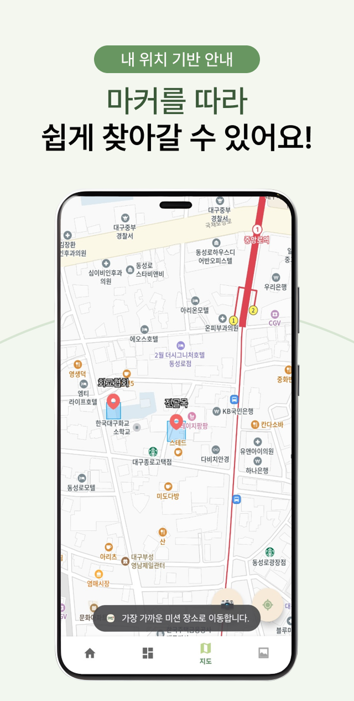
  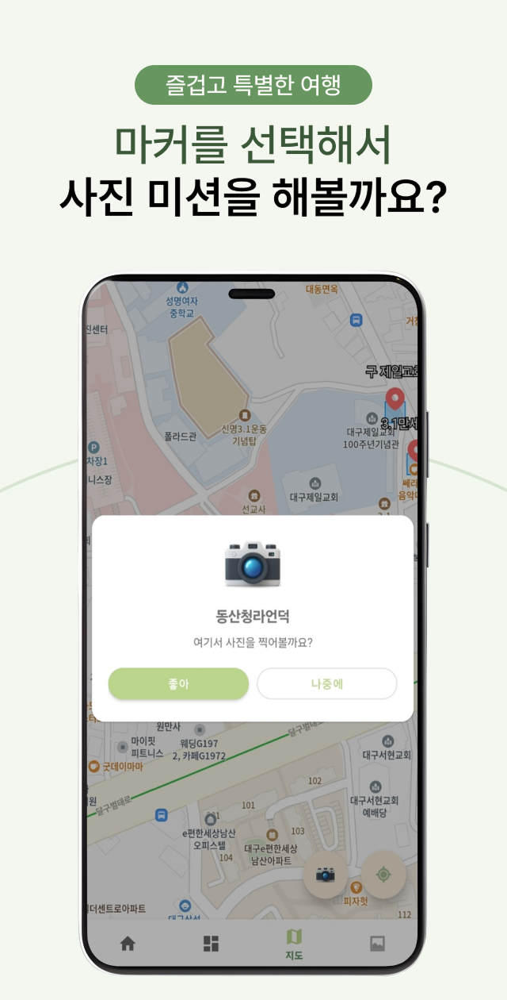
  
  

'근대로'는 대구 근대문화골목을 **GPS 기반 사진 미션**으로 탐방하고 기록하는 근대 골목 투어 앱입니다.

카카오 지도 API로 근대 골목 코스 내의 **12개 주요 장소**를 확인하고, 각 지점에서 **사진 미션**을 수행하면 완료한 기록이 **스탬프 형태**로 저장되어 탐방 추억을 한눈에 볼 수 있습니다.

공공데이터 API를 통해 장소의 **역사 설명, 근처 식당, 행사 정보**를 앱 내에서 바로 제공하여
**탐색-체험-기록**이 하나의 앱에서 자연스럽게 이어집니다.

---

## 주요 화면 및 기능 소개

### 1. 홈 화면
> 마스코트 ‘꾸미’가 미션 안내 메시지를 전달하고, 진행 상황을 한눈에 표시합니다.

  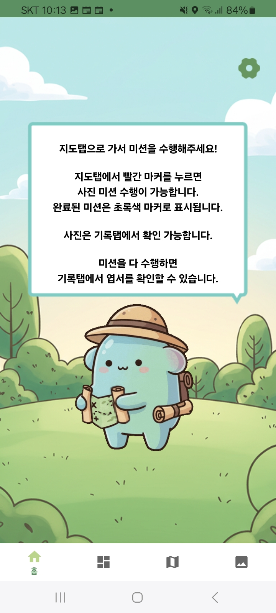
  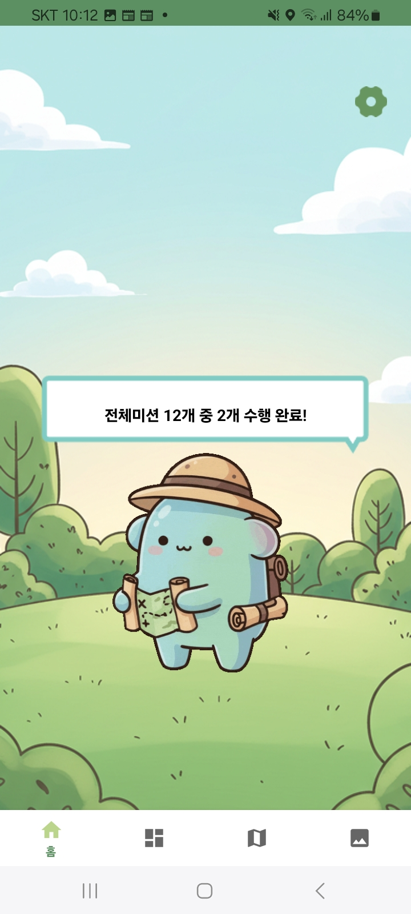

---

### 2. 로그인 화면
> 카카오 로그인으로 손쉽게 시작합니다.

  <video src="images/login1.mp4" width="200" style="border-radius:8px;" autoplay loop muted playsinline></video>

---

### 3. 지도 탭
> 카카오 지도 API 기반으로 근대문화골목 주요 장소를 표시하고, 사진 미션과 장소 설명을 제공합니다.

  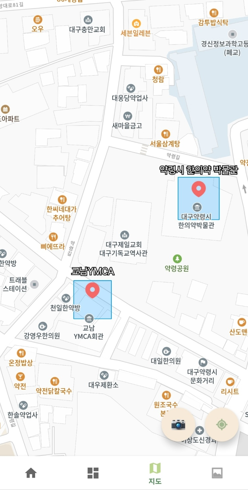
  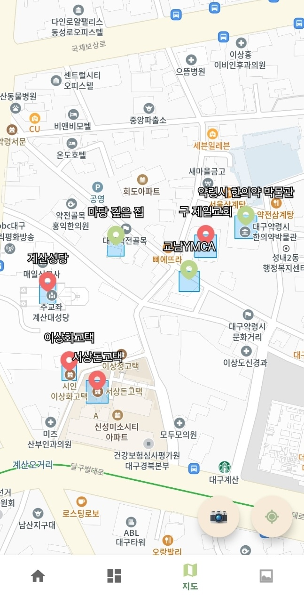

  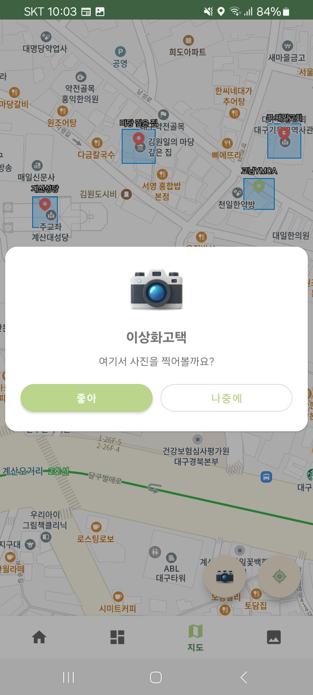
  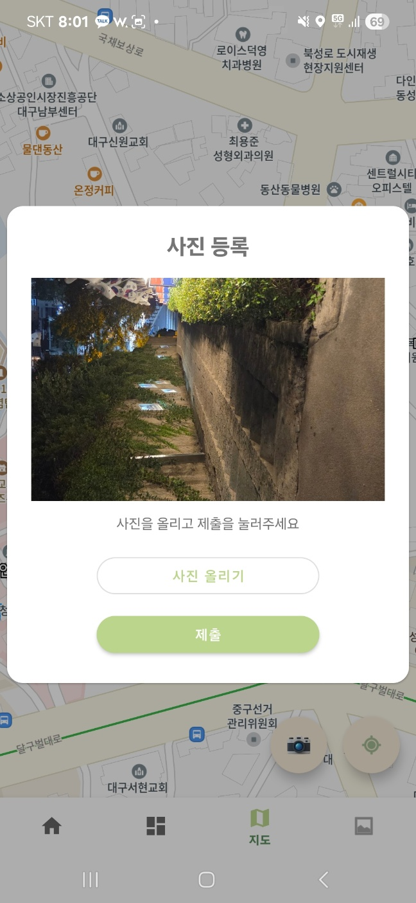
  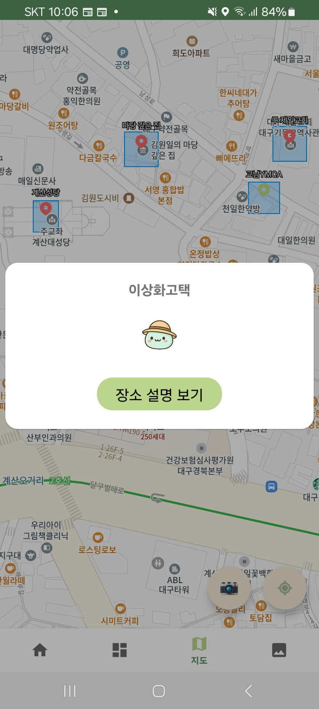
  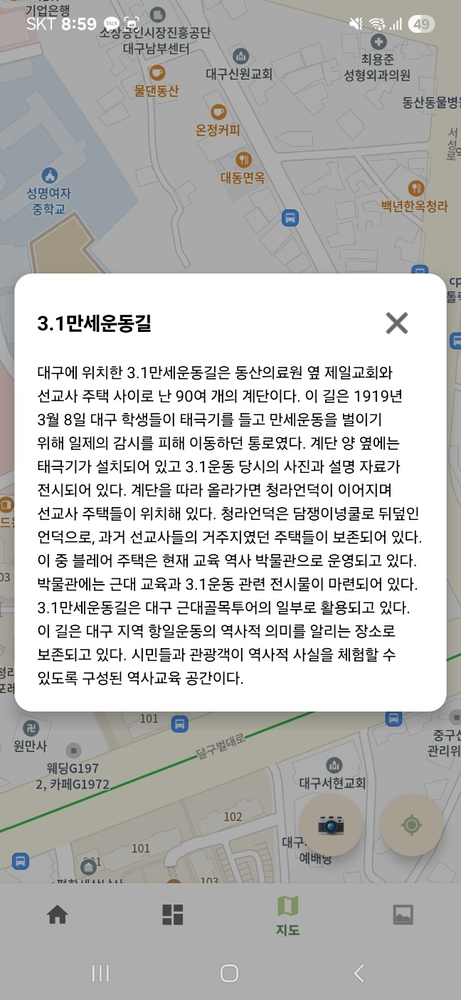

---

### 4. 근처 볼거리 탭
> 현재 위치 기반으로 근처 행사·맛집을 추천합니다.

  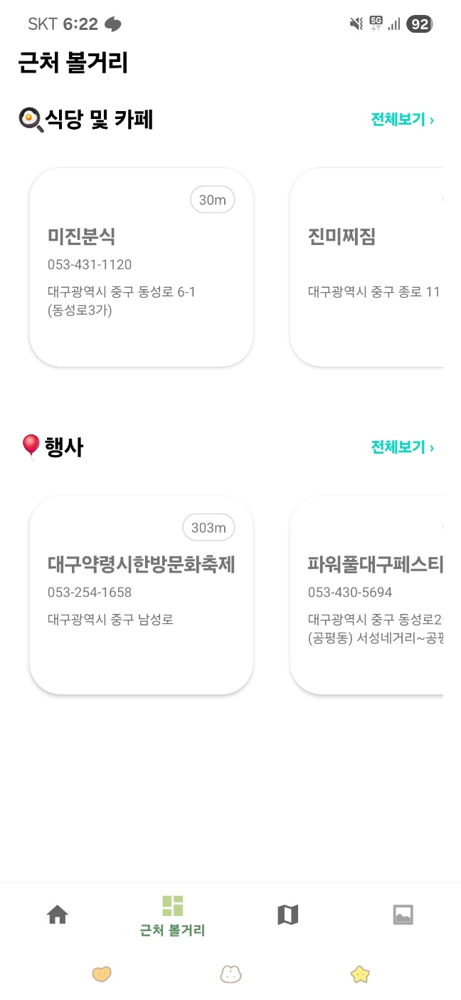
  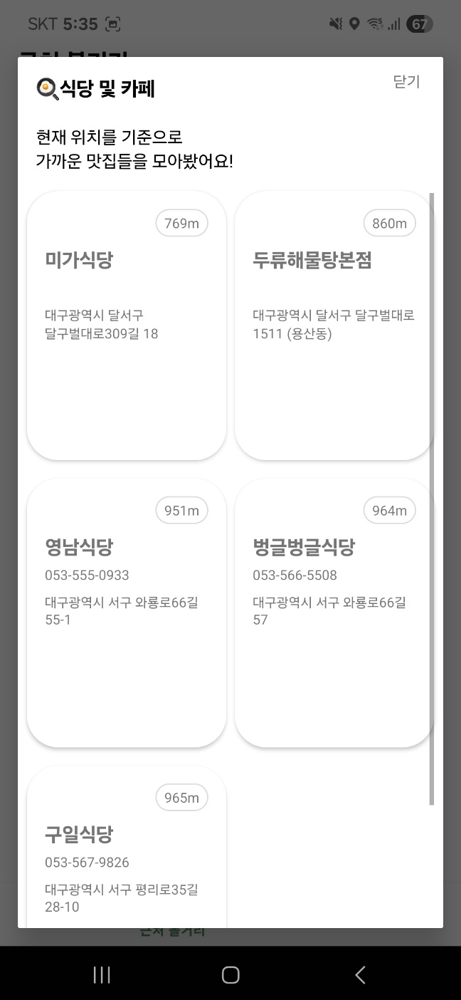

---

### 5. 기록 탭
> 미션 수행 후 스탬프를 터치해 인증샷을 확인할 수 있습니다. 모든 미션을 완료하면 ‘대구 근대 여행 완료’ 엽서를 받을 수 있습니다.

  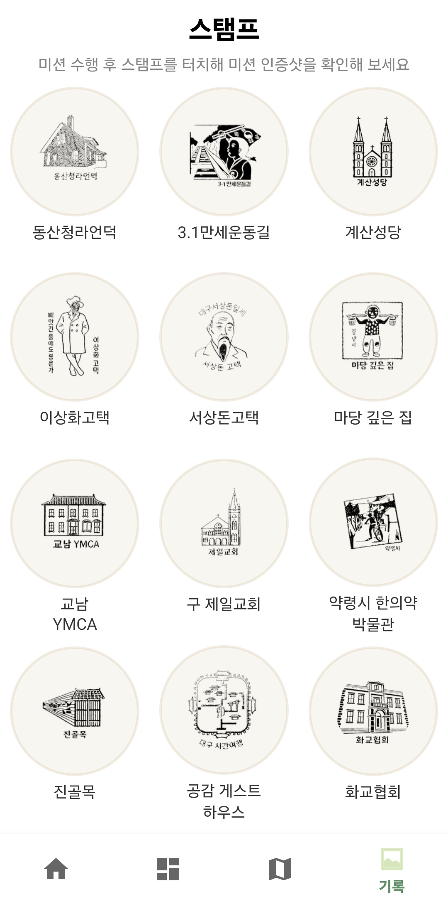
  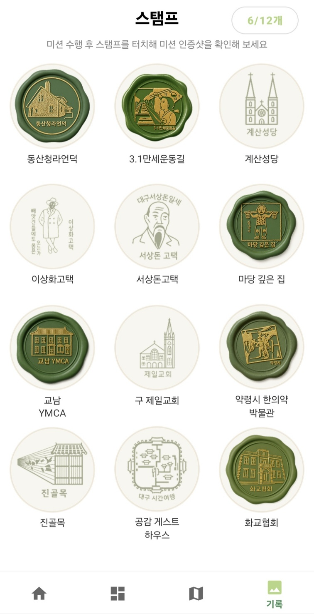
  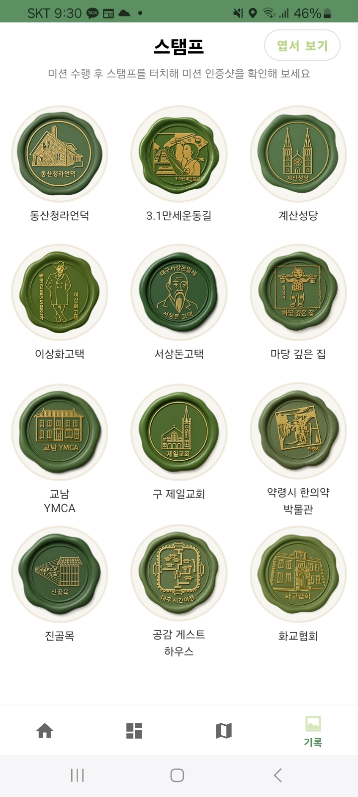

  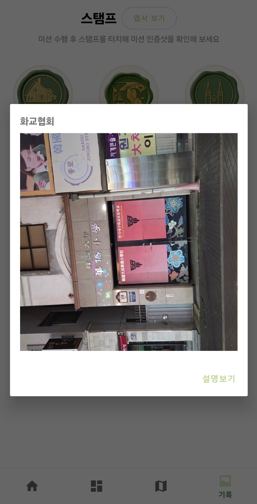
  

---
## 기술 스택

#### Android

  
  
  

#### Backend

    
    
    
    
    
    

#### Infra

  
  
  
      
  
  

#### Tools

  
  
  

## 시스템 아키텍처

---

## ERD (Entity Relationship Diagram)

---

## 성과
 <a href="https://m.onestore.co.kr/v2/ko-kr/app/0001002384">
    원스토어에 어플 출시
  </a>

 

  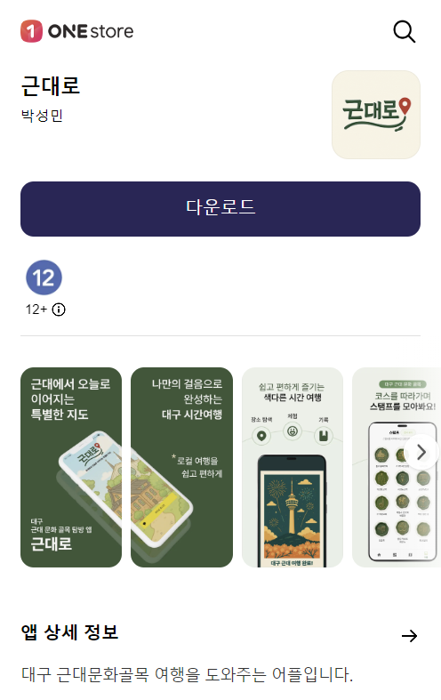

## 팀원

| **손은주** | **제갈민** | **박성민** |
|------------------|------------|------------|
| Infra            | Backend    | Android    |

